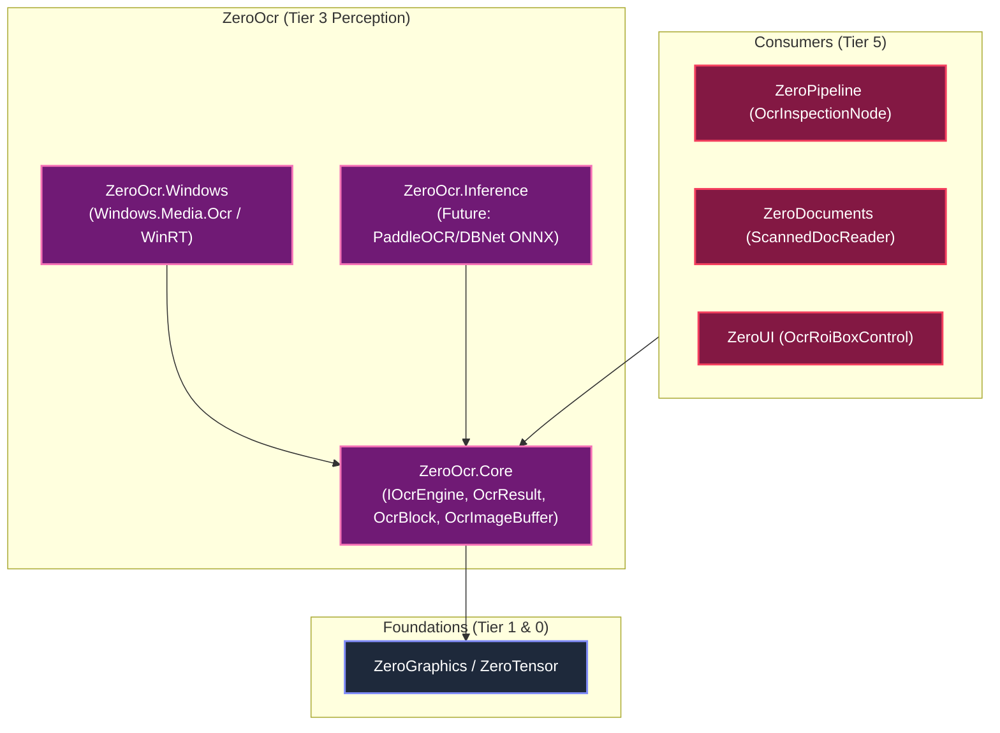

# ZeroOcr

[](LICENSE)
[](https://dotnet.microsoft.com/)
[](../../README.md)

High-performance, zero-allocation sovereign Optical Character Recognition (OCR) abstractions, spatial geometry models, memory-safe image pre-processing, and multi-engine providers (Native Windows WinRT & Edge AI) for .NET.

Part of the **ZeroPlatform** industrial ecosystem (Tier 3: Perception & Intelligence).

---

## Architecture

`ZeroOcr` is architected with a strict separation between core domain contracts and runtime engine providers:



### Sub-projects

| Project | Target Frameworks | Responsibilities |
| :--- | :--- | :--- |
| **`ZeroOcr.Core`** | `netstandard2.0`, `net462`, `net8.0` | Pure C# zero-dependency OCR domain models (`OcrResult`, `OcrBlock`, `OcrLine`, `OcrWord`, `OcrRect`, `OcrQuad`), `IOcrEngine` contract, `OcrImageBuffer`, memory-safe image pre-processors (Otsu thresholding, grayscale conversion, inversion, ROI cropping), and `MockOcrEngine`. |
| **`ZeroOcr.Windows`** | `net8.0-windows10.0.19041.0` | High-speed native Windows 10/11 WinRT OCR implementation via `Windows.Media.Ocr`. Features engine caching per BCP-47 language tag, zero-copy buffer transfer via `SoftwareBitmap`, skew angle detection, and structured token bounding box mapping. |
| **`ZeroOcr.Tests`** | `net8.0-windows10.0.19041.0` | Full unit and integration test suite with synthetic images, spatial geometry validations, and engine lifecycles. |

---

## Key Features

- **Hierarchical Document Graph**:
  - `OcrResult` &rarr; `OcrBlock` &rarr; `OcrLine` &rarr; `OcrWord`.
  - Exact bounding boxes (`OcrRect`) and rotated 4-vertex bounding polygons (`OcrQuad`).
  - Word-level and line-level confidence scoring with mean confidence aggregation.
  - Skew/orientation angle detection in degrees.

- **Zero-Allocation Image Buffering**:
  - `OcrImageBuffer` wraps contiguous managed/unmanaged byte buffers without LOH heap fragmentation.
  - Supported pixel formats: `Bgra32`, `Rgba32`, `Rgb24`, `Bgr24`, `Gray8`.
  - Zero-copy cropping for Region Of Interest (ROI) scanning.

- **Embedded Pre-processing Kernels**:
  - `OcrPreprocessor.ToGrayscale`: Fast ITU-R BT.601 integer conversion.
  - `OcrPreprocessor.BinarizeOtsu`: Dynamic bimodal histogram thresholding.
  - `OcrPreprocessor.Binarize`: Fixed thresholding.
  - `OcrPreprocessor.Invert`: Negative polarity conversion for inverted text.

- **Native Windows Engine (`WindowsOcrEngine`)**:
  - Built-in Windows 10/11 OCR without requiring external model weights or C++ dependencies.
  - Reusable concurrent engine cache (`ConcurrentDictionary<string, OcrEngine>`) to eliminate runtime engine creation overhead.

---

## Quick Example

### 1. Recognizing Text from Image Buffer
```csharp
using ZeroOcr.Core.Imaging;
using ZeroOcr.Core.Interfaces;
using ZeroOcr.Windows;

IOcrEngine ocr = new WindowsOcrEngine();

if (ocr.IsAvailable)
{
    // Raw BGRA32 pixel buffer (e.g. from camera frame or screen capture)
    var imageBuffer = OcrImageBuffer.FromBgra32(width, height, rawPixelBytes);

    var options = new OcrOptions
    {
        LanguageTag = "en-US",
        MinConfidence = 0.8f
    };

    var result = await ocr.RecognizeAsync(imageBuffer, options);

    if (result.Success)
    {
        Console.WriteLine($"Recognized {result.Lines.Count} lines in {result.Elapsed.TotalMilliseconds:F1}ms:");
        foreach (var line in result.Lines)
        {
            Console.WriteLine($"[{line.BoundingBox}] {line.Text} (Conf: {line.Confidence:P0})");
        }
    }
}
```

### 2. Cropping Region of Interest (ROI)
```csharp
// Inspect only a specific sub-region (e.g., product barcode / date code zone)
var roi = new OcrRect(x: 100, y: 50, width: 300, height: 80);
var options = new OcrOptions { RegionOfInterest = roi };

var result = await ocr.RecognizeAsync(imageBuffer, options);
```

---

## Target Frameworks

- `.NET Standard 2.0` (Core Abstractions)
- `.NET Framework 4.6.2` (Core Abstractions)
- `.NET 8.0` (Core Abstractions)
- `.NET 8.0-windows10.0.19041.0` (Native Windows Engine & Tests)

---

## License

MIT License. Copyright © 2026 Phong Võ.
Part of the ZeroPlatform Industrial Ecosystem.
